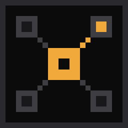
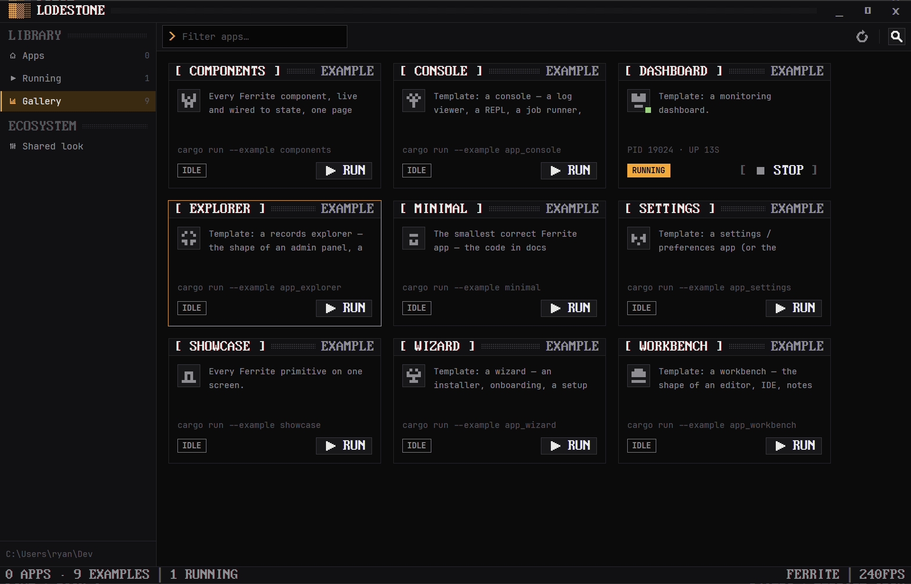
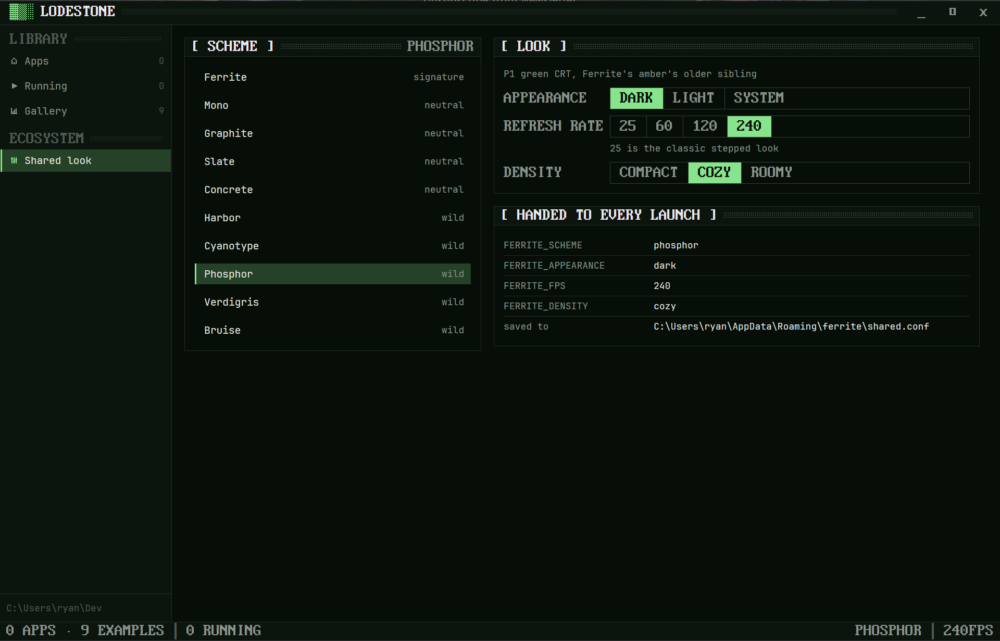

<p align="center">
  
</p>

<h1 align="center">Lodestone</h1>

<p align="center">
  One window for every <a href="https://github.com/rwetz/ferrite-design">Ferrite</a> app:
  install them from GitHub, launch them, share one look.
</p>

<p align="center">
  <a href="https://github.com/rwetz/ferrite-lodestone/actions/workflows/ci.yml"></a>
  <a href="https://github.com/rwetz/ferrite-lodestone/releases/latest"></a>
  <a href="LICENSE"></a>
</p>



A lodestone is the naturally magnetic rock that pulls iron toward it.
Lodestone does the same for Ferrite apps. It finds every Ferrite app on
GitHub, installs the one you pick from its latest release, starts it with
one click, and holds one shared look that every app it starts inherits.
It never compiles anything.

It's a native desktop app built with [GPUI](https://gpui.rs) and
[ferrite-design](https://github.com/rwetz/ferrite-design): amber on iron,
0px corners, pixel type and stepped motion. It runs no webview.

## Features

- **Discovery.** Lodestone lists the public GitHub repos of
  [rwetz](https://github.com/rwetz) that carry the `ferrite-app` topic,
  with each one's latest release. The list is cached, so Lodestone opens
  with your apps offline too.
- **Install and update.** **Install** downloads the release archive for
  your platform, checks it against the release's `SHA256SUMS.txt`, and
  unpacks it. A progress bar shows the download. When a newer release is
  out, the tile says so and offers **Update**; **Update all** in the
  toolbar updates every app that has one (a running app waits until you
  stop it).
- **Updates itself.** Each check also looks at Lodestone's own releases.
  When a newer one is out, a banner offers **Update Lodestone**: it
  downloads and verifies the release the same way, swaps the new binary in
  where the running one is, and **Restart now** opens it. Apps you started
  keep running.
- **Live tiles.** Each tile shows the app's version and how long ago it
  was released (`v0.1.1 · 8 hours ago`), and its state: not installed,
  installed, update, installing, running, stopped, exited or failed. While
  an app runs, the tile shows its process ID and uptime.
- **Launch and stop.** **Run** starts the installed binary directly, so it
  opens at once. Lodestone holds that process, so **Stop** really stops it.
- **Shared look.** Pick a scheme (any of Ferrite's ten), an appearance, a
  refresh rate and a density. Lodestone re-themes at once, saves the choice,
  and hands it to every app it starts as the `FERRITE_*` variables that
  ferrite-design's `theme::apply_env` already reads.
- **Ferrite throughout.** A boot screen at launch, a command palette
  (<kbd>Ctrl</kbd>+<kbd>Shift</kbd>+<kbd>P</kbd>) with an Install or Launch
  command for every app, a search filter, and a CRT switch-off when you
  close the window.



## Install

### Download

Prebuilt binaries for Windows, macOS and Linux are attached to each
[release](https://github.com/rwetz/ferrite-lodestone/releases/latest).
Unpack the archive and run `lodestone` from anywhere. Apps need no Rust
toolchain: Lodestone downloads their release builds.

### From source

```bash
git clone https://github.com/rwetz/ferrite-lodestone
cd ferrite-lodestone
cargo run --release
```

On Linux you need the usual GPUI development packages first:

```bash
sudo apt install libxkbcommon-dev libxkbcommon-x11-dev libwayland-dev libxcb1-dev libfontconfig-dev
```

On macOS with Xcode 27 or later, install the Metal toolchain once:

```bash
xcodebuild -downloadComponent MetalToolchain
```

## Usage

Open Lodestone and press **Install** on an app, then **Run**. The refresh
button checks GitHub again for new apps and updates; Lodestone also checks
once at every start.

Installed apps live in one folder per app, with the current version inside:

| OS | Path |
|---|---|
| Windows | `%LOCALAPPDATA%\ferrite\apps\<repo>\<tag>\` |
| macOS | `~/Library/Application Support/ferrite/apps/…` |
| Linux | `$XDG_DATA_HOME/ferrite/apps/…` (or `~/.local/share/…`) |

An update unpacks the new version next to the old one and removes the old
one afterwards (or at the next update, if it was still running).

Lodestone updates itself in place: the running binary is renamed to
`lodestone.old` (Windows lets a running program be renamed, not
overwritten), the new one takes its name, and the next start deletes
`lodestone.old`. It needs write access to its own folder; if it doesn't
have that, the banner says so and links the release to download by hand.

GitHub allows 60 anonymous API requests an hour, and a check costs one plus
one per app. Set `GITHUB_TOKEN` to raise that limit.

### Making an app show up

1. Scaffold it with ferrite-design's `scripts/new-app.sh ferrite-<thing> <template>`.
   Its release workflow builds Windows, macOS and Linux archives when you
   push a `v*` tag.
2. Add the `ferrite-app` topic to the GitHub repo.
3. Push a tag, wait for the release, and press refresh in Lodestone.

### The shared look

The look is stored as plain `key = value` lines in:

| OS | Path |
|---|---|
| Windows | `%APPDATA%\ferrite\shared.conf` |
| macOS | `~/Library/Application Support/ferrite/shared.conf` |
| Linux | `$XDG_CONFIG_HOME/ferrite/shared.conf` (or `~/.config/…`) |

```ini
scheme = phosphor     # ferrite mono graphite slate concrete harbor cyanotype phosphor verdigris bruise
appearance = dark     # dark | light | system
fps = 25              # 12–240; 25 is the classic stepped look
density = cozy        # compact | cozy | roomy
```

Apps started by Lodestone get these values as `FERRITE_SCHEME`,
`FERRITE_APPEARANCE`, `FERRITE_FPS` and `FERRITE_DENSITY`. Apps you start
some other way don't read the file yet; that waits on ferrite-design's
planned settings store.

## Development

```bash
cargo test                    # GitHub parsing, checksums, versions, the settings file
cargo clippy --all-targets
cargo run
```

- `src/registry.rs` covers the GitHub catalog, installing and starting
  apps, and the shared-look file. Its parsing is pure and unit-tested.
- `src/main.rs` holds the views. It follows ferrite-design's
  [AGENTS.md](https://github.com/rwetz/ferrite-design/blob/main/AGENTS.md):
  colors only from the palette, one accent, `panel()` for regions, and
  motion only for events.

## License

Apache-2.0, see [LICENSE](LICENSE). The binary embeds fonts from
ferrite-design under their own licenses; see [NOTICE](NOTICE).

## Automatic releases

Every push to `main` runs the release workflow. It chooses the next available
patch version (or honors a higher version set in `Cargo.toml`), creates a release
commit with matching `Cargo.toml` and `Cargo.lock` versions, and tags that commit.
Release commits stay off `main`, so the workflow cannot create a push loop.
Builds and tests must succeed before publication. Rerunning a workflow reuses
its tag. Manual `vMAJOR.MINOR.PATCH` tags still work when they match the package
version. Push feature branches normally; they do not publish releases.
