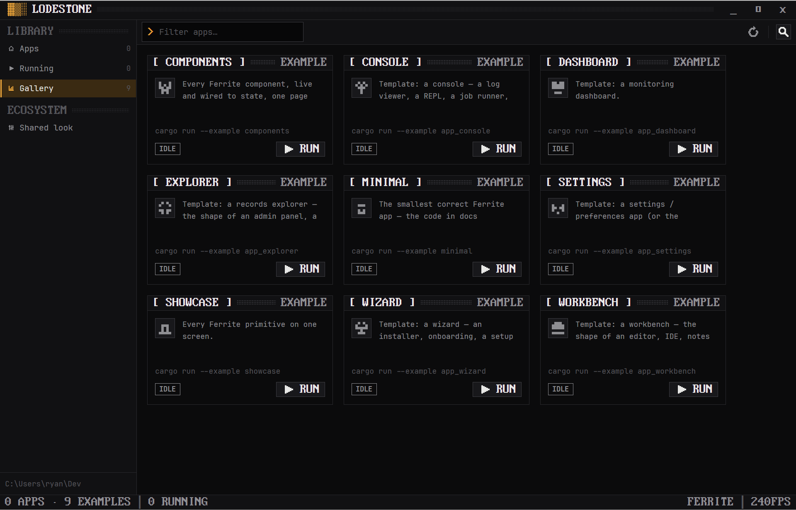

<p align="center">
  
</p>

<h1 align="center">Lodestone</h1>

<p align="center">
  One window for every <a href="https://github.com/rwetz/ferrite-design">Ferrite</a> app:
  launch them, watch them, share one look.
</p>

<p align="center">
  <a href="https://github.com/rwetz/ferrite-lodestone/actions/workflows/ci.yml"></a>
  <a href="https://github.com/rwetz/ferrite-lodestone/releases/latest"></a>
  <a href="LICENSE"></a>
</p>


A lodestone is the naturally magnetic rock that pulls iron toward it.
Lodestone does the same for Ferrite apps. It finds every app in your
workspace, shows each one as a live tile, builds and starts it with one
click, and holds one shared look that every app it starts inherits.

It's a native desktop app built with [GPUI](https://gpui.rs) and
[ferrite-design](https://github.com/rwetz/ferrite-design): amber on iron,
0px corners, pixel type and stepped motion. It runs no webview.

## Features

- **Discovery.** Lodestone scans a folder one level deep for crates that
  depend on `ferrite-design`. If ferrite-design itself is checked out there,
  its examples (the component gallery, the showcase and the seven app
  templates) appear on a separate Gallery page.
- **Live tiles.** Each tile shows the app's state (idle, building, running,
  stopped, exited or failed). While an app runs, the tile shows its process
  ID and uptime; otherwise it shows the last commit.
- **Launch and stop.** Lodestone runs `cargo build` in the background, then
  starts the app's own binary. It holds that real process, so **Stop**
  actually stops the app. If a build fails, the error shows in the details
  drawer.
- **Shared look.** Pick a scheme (any of Ferrite's ten), an appearance, a
  refresh rate and a density. Lodestone re-themes at once, saves the choice,
  and hands it to every app it starts as the `FERRITE_*` variables that
  ferrite-design's `theme::apply_env` already reads.
- **Ferrite throughout.** A boot screen at launch, a command palette
  (<kbd>Ctrl</kbd>+<kbd>Shift</kbd>+<kbd>P</kbd>) with a Launch command for
  every app, a search filter, and a CRT switch-off when you close the window.

| Gallery | Shared look (Phosphor) |
|---|---|
|  |  |

## Install

### Download

Prebuilt binaries for Windows, macOS and Linux are attached to each
[release](https://github.com/rwetz/ferrite-lodestone/releases/latest).
Unpack the archive and move `lodestone` into the folder that holds your
apps: Lodestone scans only the folder it lives in (see [Usage](#usage)), so
started from Downloads it finds nothing. Launching apps needs a Rust
toolchain (`cargo`) on your `PATH`, because Lodestone builds each app from
its source checkout before starting it; downloaded app binaries aren't
discovered.

### From source

```bash
git clone https://github.com/rwetz/ferrite-lodestone
cd ferrite-lodestone
cargo run --release
```

On Linux you need the usual GPUI development packages first:

```bash
sudo apt install libxkbcommon-dev libxkbcommon-x11-dev libwayland-dev libxcb1-dev libfontconfig-dev
```

On macOS with Xcode 27 or later, install the Metal toolchain once:

```bash
xcodebuild -downloadComponent MetalToolchain
```

## Usage

Lodestone shows only the Ferrite apps in the folder it lives in, one level
deep:

- run from source, that is the folder holding the `ferrite-lodestone` checkout
- as a downloaded binary, that is the folder you put `lodestone` in

So keep Lodestone next to your apps:

```
Dev/
├── ferrite-design/      # its examples appear on the Gallery page
├── ferrite-lodestone/   # this repo (or just the lodestone binary)
├── ferrite-pulse/       # any crate that depends on ferrite-design
└── ferrite-almanac/
```

New apps come from ferrite-design's scaffold script:
`scripts/new-app.sh ferrite-<thing> <template>`. Press the rescan button and
they appear.

### The shared look

The look is stored as plain `key = value` lines in:

| OS | Path |
|---|---|
| Windows | `%APPDATA%\ferrite\shared.conf` |
| macOS | `~/Library/Application Support/ferrite/shared.conf` |
| Linux | `$XDG_CONFIG_HOME/ferrite/shared.conf` (or `~/.config/…`) |

```ini
scheme = phosphor     # ferrite mono graphite slate concrete harbor cyanotype phosphor verdigris bruise
appearance = dark     # dark | light | system
fps = 25              # 12–240; 25 is the classic stepped look
density = cozy        # compact | cozy | roomy
```

Apps started by Lodestone get these values as `FERRITE_SCHEME`,
`FERRITE_APPEARANCE`, `FERRITE_FPS` and `FERRITE_DENSITY`. Apps you start
some other way don't read the file yet; that waits on ferrite-design's
planned settings store.

## Development

```bash
cargo test                    # discovery, manifest parsing, the settings file
cargo clippy --all-targets
cargo run
```

- `src/registry.rs` covers discovery, building and starting apps, and the
  shared-look file. Its parsing is pure and unit-tested.
- `src/main.rs` holds the views. It follows ferrite-design's
  [AGENTS.md](https://github.com/rwetz/ferrite-design/blob/main/AGENTS.md):
  colors only from the palette, one accent, `panel()` for regions, and
  motion only for events.

## License

Apache-2.0, see [LICENSE](LICENSE). The binary embeds fonts from
ferrite-design under their own licenses; see [NOTICE](NOTICE).
